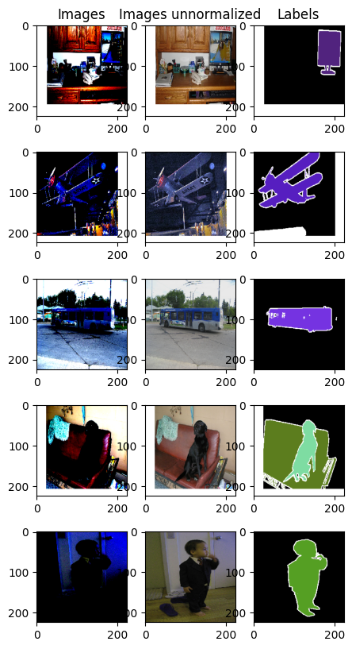
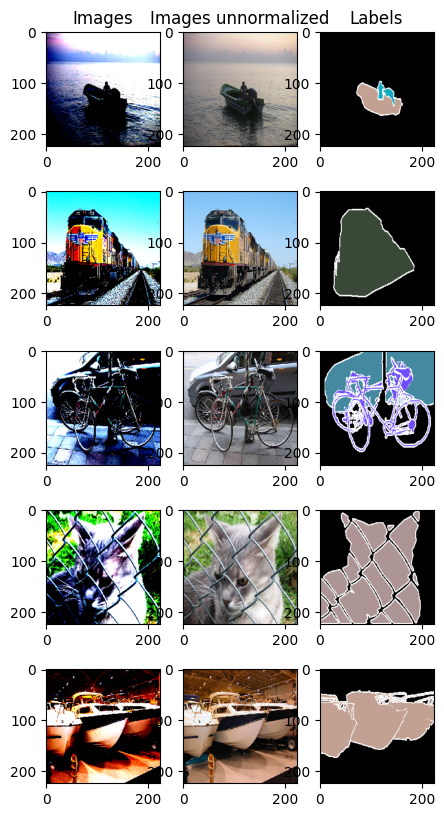
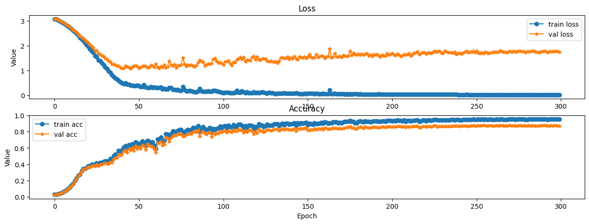
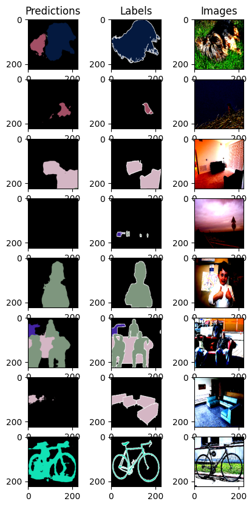
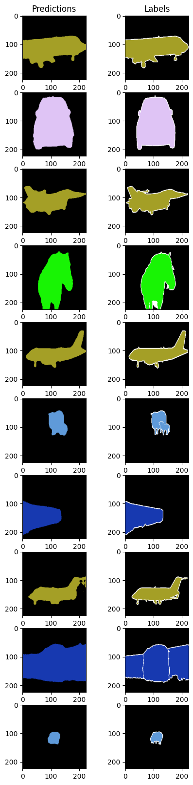
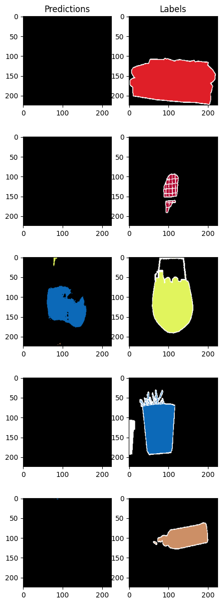
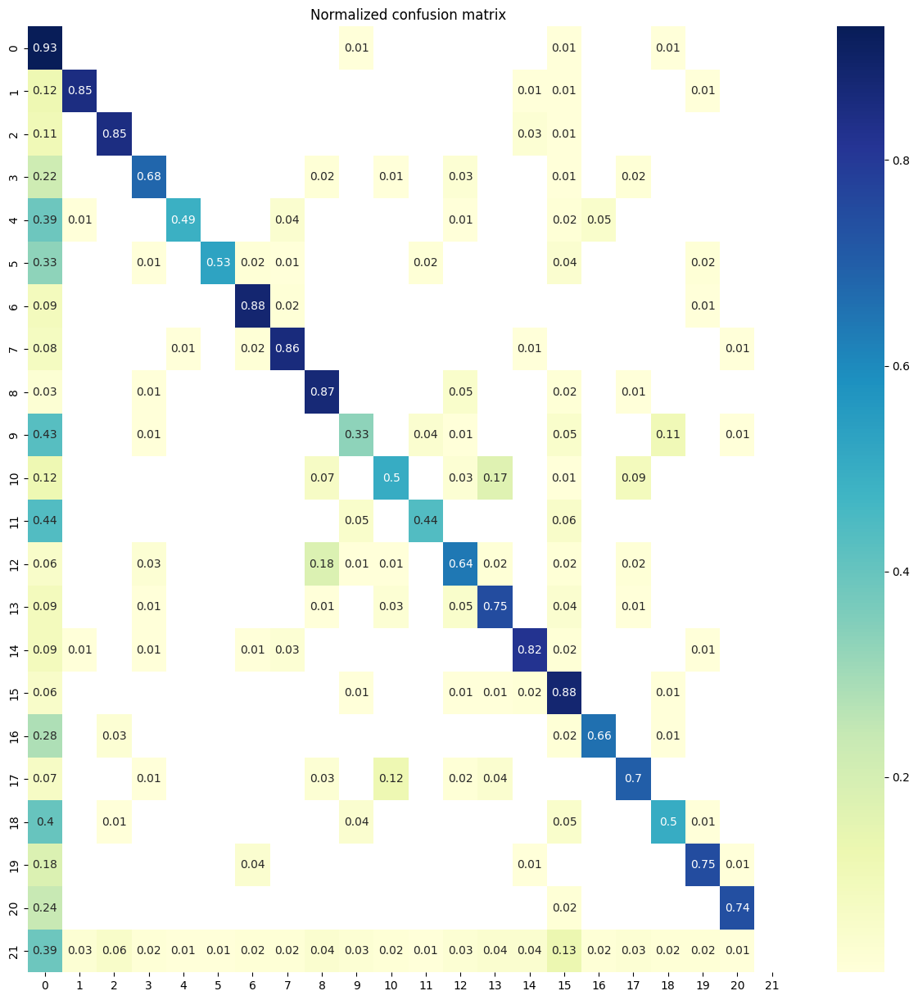

# VOC Semantic Segmentation With Custom Model

## Model
The model was inspired by a [U-Net](https://arxiv.org/abs/1505.04597), [SegNet](https://arxiv.org/abs/1511.00561) and [Fully Convolutional Networks](https://arxiv.org/abs/1411.4038) models and is a convolutional encoder-decoder network with skipped-connections. I used a pre-trained [VGG16](https://arxiv.org/abs/1409.1556) network with Batch Normalization as an encoder. Decoder network was designed by me. Model was trained from scratch with Pytorch.

## Data
I trained model on 2012 VOCSegmentation's train dataset (1464 samples). For validation (725 samples) and test (725 samples) I used randomly splitted 2012 VOCSegmentation's validation dataset.

### Augmentation
For spacial augmentations I used: horiontal flip, rotation, translation and scaling. As a color augmentations I used Gaussian Blur, ColorJitter and brightness & contrast change. Below are examples from the training and validation sets.

#### Example of images from train dataset

#### Example of images from validation dataset

## Training
Training hyperparameters are presented below. Unfortunately I didn't have enough computational power to get the best hyperparameters set or train the model for hours.
| | |
| ------------- | ------------- |
| Optimizer | Adam (lr=1e-4) |
| Scheduler | One Cycle LR |
| Epochs | 300 |
| Patience | 30 |
| L1 regularization coeficient | 1e-6 |

Moreover, beacuse of data inbalance I used weighted CrossEntropy loss. Model was trained for 1 hour 49 minutes on Nvidia GeForce RTX 3090 Ti.

### Trining curves

### Test results
The model achieved an pixel-level accuracy at __87.95 %__ on half of the VOC Segmentation's validation set (which was my test dataset), which is comparable to the results achieved in the literature.

#### Five random examples from the validation dataset of images with predictions and labels.

#### Ten best predicted images from the test dataset

#### Five worst predicted images from the test dataset

#### Confusion matrix
